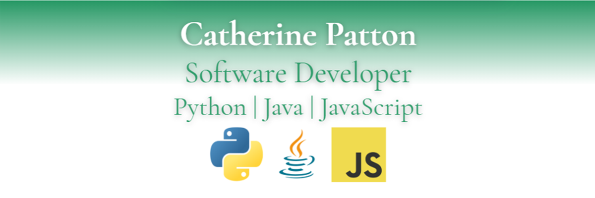

# About me

I'm transitioning into software development after 20+ years in higher education and biotech. Now specializing in Python, Java, and JavaScript, I've built projects ranging from console applications to full-stack web apps. I bring strong problem-solving, communication, and teamwork skills to every project.

**Core Languages & Frameworks**  

**Databases**  

**Web**  

**Other Languages**  

**Tools & IDEs**  

**Foreign Languages**  

